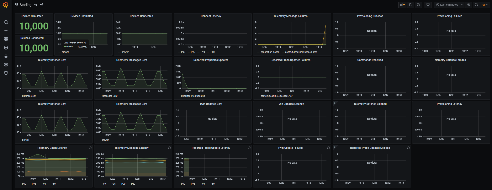
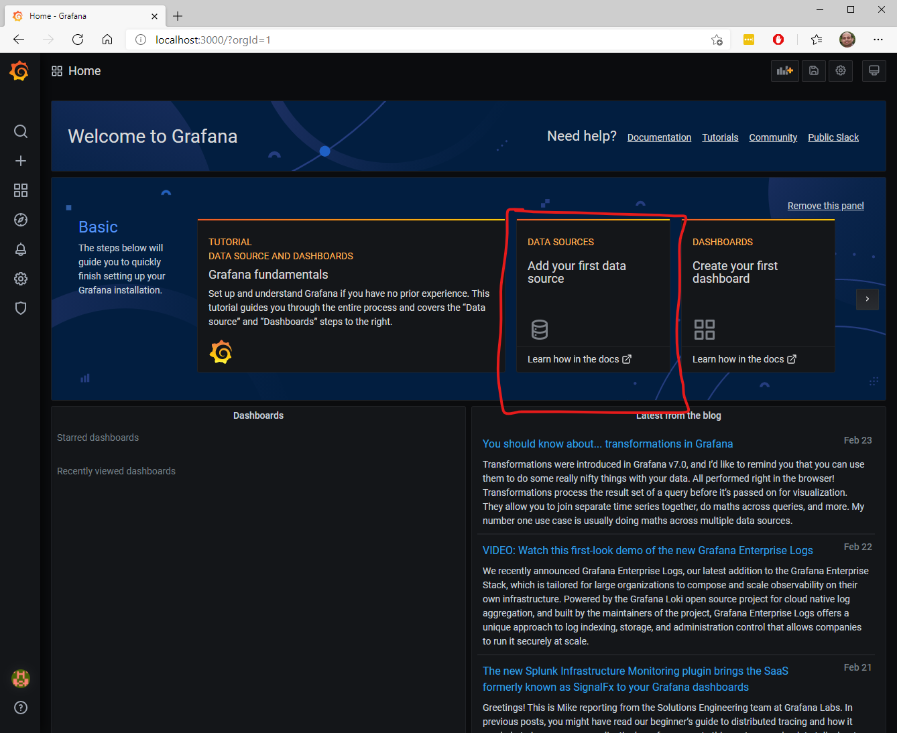
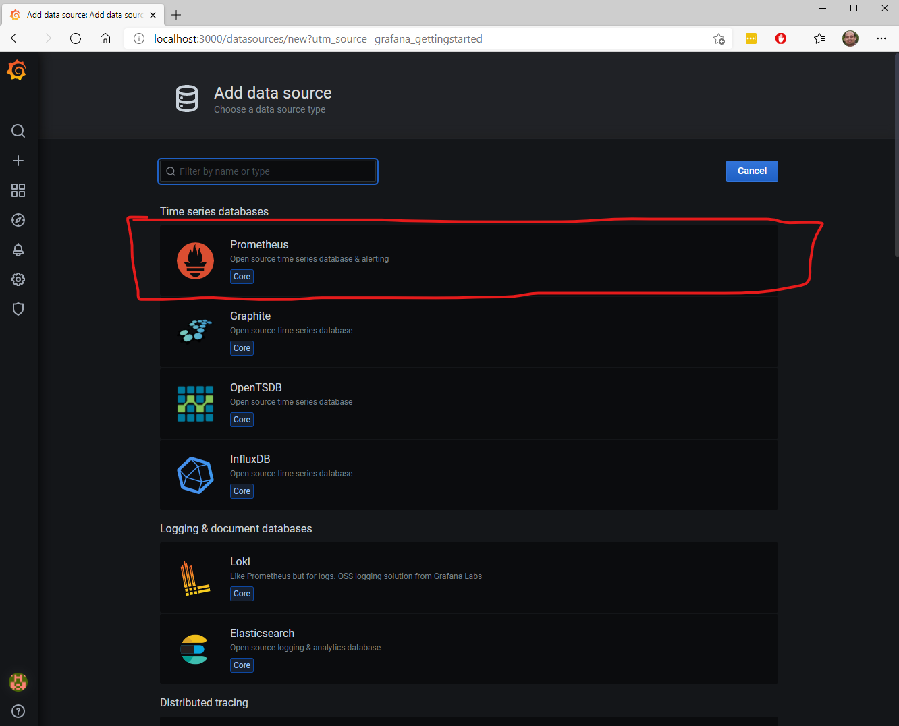
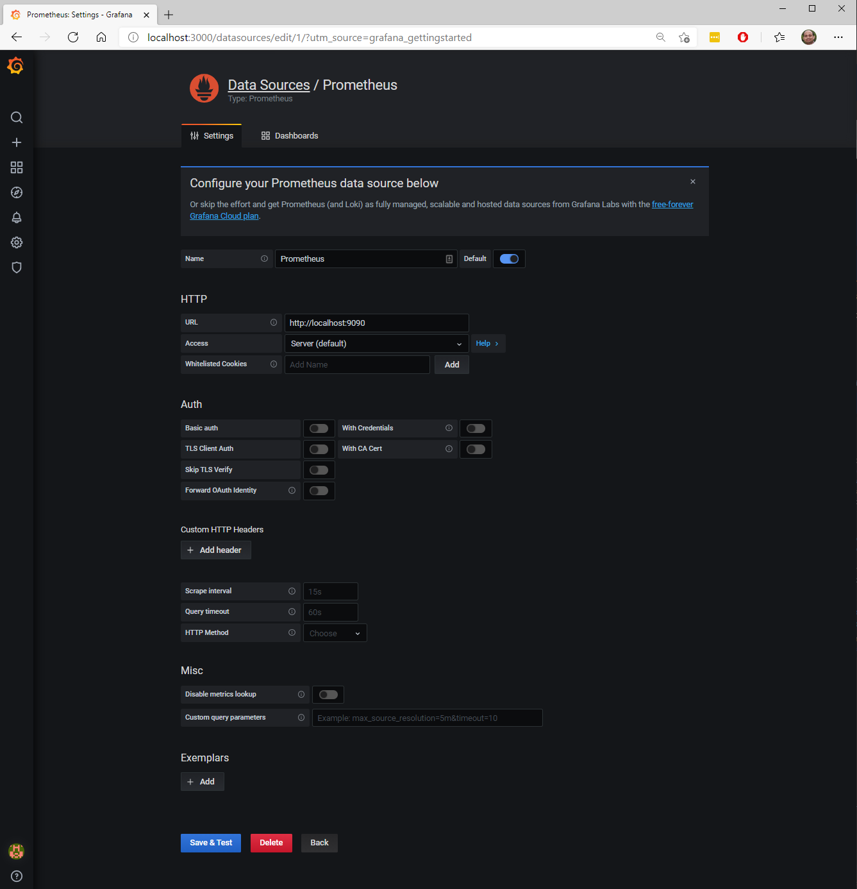
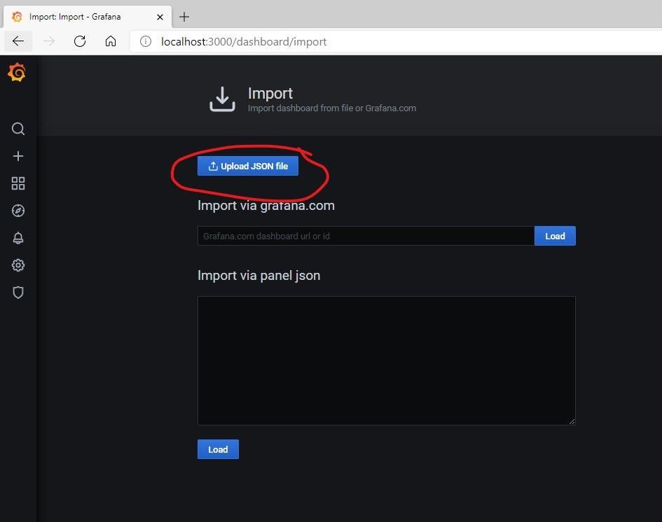
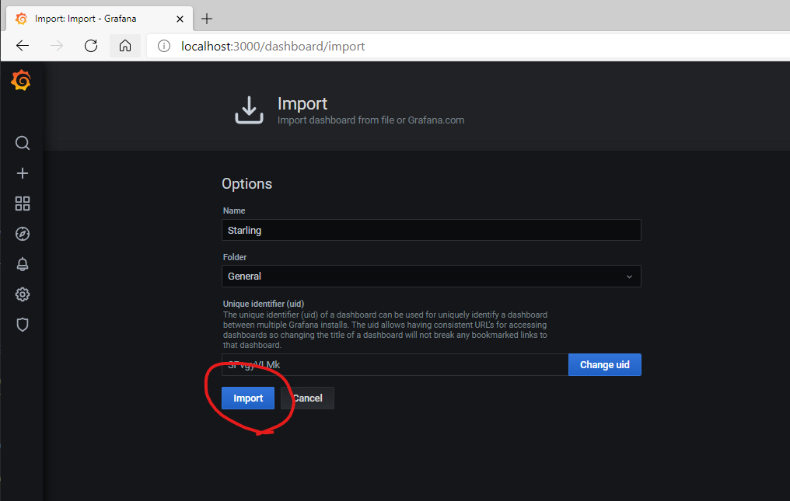
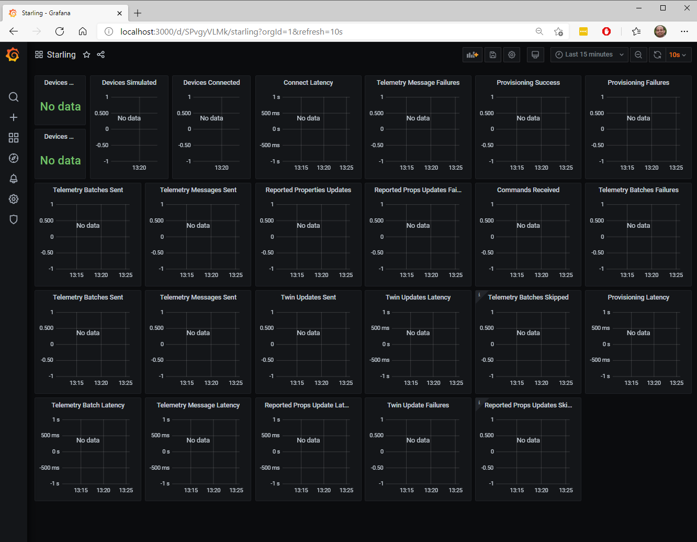
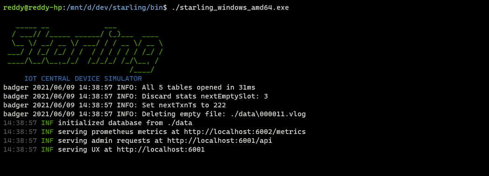

# Starling - Azure IoT Central Device Simulator
This tool lets you scale test your IoT solution built on Azure IoT Central by simulating tens of thousands of devices.


## Development Environment Setup ##

### Golang ###
Follow the instructions to [install Go](https://golang.org/doc/install). Pick the appropriate package to install the 
latest 1.15.x release of Go. This will give you access to the Go toolchain and compiler.

- If you are on Windows, use the MSI to install. It will set the necessary environment variables.
- If you installed via the tarball, you will need to add a GOROOT environment variable pointing to the 
  folder where you installed Go (typically /usr/local/go on linux-based systems)
- You should also check to make sure that you can access the Go compiler and tools. They are available at $GOROOT/bin 
  (or $GOROOT\bin) and should be added to your path if they are not already. You can verify this by running the following:
  - Max/Linux: `which go`
  - Windows (CMD): `where go`

### Prometheus ###
Starling simulator metrics are available from the [http://localhost:6002/metrics](http://localhost:6002/metrics) endpoint. 
Promethus can be configured to scrape these metrics periodically (15 secs, by default) and store in its timeseries 
database locally for analysis.

1. __Prometheus Install:__ Download [Prometheus](https://prometheus.io/download/) and unzip into a folder. 
2. __Configure Prometheus:__ Copy over the [setup/prometheus.yml](setup/prometheus.yml) file into the install folder. 
   You can run the prometheus.exe executable in the install folder. By default prometheus is avaialble 
   at [http://localhost:9090](http://localhost:9090)

### Grafana ###
Timeseries metrics from Prometheus can be analyzed in a graphical dashboard tool called Grafana.

1. __Grafana Install:__ Download [Grafana](https://grafana.com/grafana/download) and unzip into a folder. 
   Run the `Grafana_Install_Dir/bin/grafana-server.exe` file. Grafana can be accessed from 
   [http://localhost:3000/](http://localhost:3000/). Once you can access the site, login admin/admin or admin/ [no password].
   

2. __Data Source Setup:__ Add data source (second tile on the homepage), select Prometheus with the following parameters:
   
   

Parameter  | Value
-----------|-------------
Name       | Prometheus
Url        | http://localhost:9090
Access     | Server (default)

Click _Save & Test_ button.


3. __Dashboard Setup:__ Select  `+ -> Import` menu item on the left navbar and select `Upload JSON File`. 
   Select [setup/grafana-dashboard.json](setup/grafana-dashboard.json) file. Once you start running the Starling server, 
   Prometheus and Grafana will come alive.
   
   
   
   You should see the following dashboard. Once we start the Starling server, this will start showing simulation data.
   

## Build ##
Golang produces OS specific executables. You can create a binary targeting any OS from any OS.

To build starling, you can use the makefile. 
1. Windows: `make buildwindows` or `go build -o bin/starling.exe -v`
2. Mac: `make buildmac`
3. Linux: `make buildlinux`

To cleanup, use `make clean`

## Simulation ##
Starling simulator has a single executable `bin/starling.exe` on windows or `bin/starling` on mac/linux.

### Configuration file ###
Starling uses `$HOME/.starling.yaml` configuration file to set several timeouts and behaviors. Can you can copy 
[setup/.starling.yaml](setup/.starling.yaml) to `$HOME/` 
```yaml
HTTP:
    adminPort: 6001                     # Port number of the administrative service.
    metricsPort: 6002                   # Port number for Prometheus service to scrape.
Simulation:
    connectionTimeout: 30000            # Connection timeout in milli seconds.
    telemetryTimeout: 30000             # Telemetry send timeout in milli seconds.
    twinUpdateTimeout: 30000            # Twin update timeout in milli seconds.
    commandTimeout: 30000               # Command ack timeout in milli seconds.
    registrationAttemptTimeout: 30000   # Device registration timeout in milli seconds.
    maxConcurrentConnections: 100       # Maximum number of concurrent connections to send telemetry per simulation.
    maxConcurrentTwinUpdates: 10        # Maximum number of concurrent twin updates per simulation.
    maxConcurrentRegistrations: 10      # Maximum number of concurrent device registrations (DPS calls).
    maxConcurrentDeletes: 10            # Maximum number of concurrent device deletes.
    maxRegistrationAttempts: 10         # Maximum number of device registration attempts.
    enableTelemetry: true               # Enable device telemetry sends across all simulations.
    enableReportedProps: true           # Enable device reported property sends across all simulations.
    enableTwinUpdateAcks: true          # Enable device twin (desired property) update acknowledgement across all simulations.
    enableCommandAcks: true             # Enable device command (direct method, C2D) acknowledgement across all simulations.
Data:
    dataDirectory: "."                  # Directory used for storing Simulation data.
Logger:
    logLevel: debug                     # Logging legel for the logger. Available logging levels are - panic, fatal, error, warn, info, debug, trace.
```

### Running Simulation Server ###
To start the starling simulation server, run `bin/starling.exe` on windows or `bin/starling` on mac/linux


### Create Central application ###
Create an IoT Central application and create a new **brewer** device template by uploading `bin/brewer.json`.
Publish the brewer device template. Create an API Token with administrator role and copy it. 

### Configuring Simulations ###
Now that the simulator is running, we need to configure the simulations using the Starling API.
`scripts/loadData.sh` has the `curl` commands to seed some demo data into the simulator. 
Edit the first few lines of the `scripts/loadData.sh` with appropriate settings for your application created in the above step.
```
## CHANGE THESE VALUES based on your application
APP_DESCRIPTION="my test application"       # brief description of the application
APP_URL="YOUR APP.azureiotcentral.com"      # application url
ID_SCOPE="YOUR SCOPE ID HERE"               # application DPS ID scope for the application (get it from admin/device connection)
MASTER_KEY="YOUR MASTER KEY"                # application master key (get it from Admin/Device Connection)
API_TOKEN="YOUR API TOKEN"                  # API token with admin role (get it from Admin/API Token)
```
Open a shell prompt (e.g.: [gitbash](https://git-scm.com/download/win) on windows or bash terminal in mac/linux).
```
$ cd scripts
$ ./loadData.sh
```

### Executing Simulation ###
Start the simulation using `scripts/startSim.sh`. Once the simulation is started, you can check the Grafana dashboard to 
monitor the simulation. 

### Provisioning and Deleting Devices ###
In the configuring section above, 10 brewers are configured for the simulation. You can increase the number of brewers
in the `scripts/loadData.sh` file and run it to seed the data. Starling automatically provisions the devices when the
simulation is started. If you have large number of devices in simulation, you can explicitly provision using the
`scripts/provisionDevices.sh`. Change the number of devices in the `scripts/provisionDevices.sh` script. 

To delete devices you can use `deleteDevices.sh`. Change the number of devices in the `deleteDevices.sh` script.

### Postman ###
Instead of shellscripts as mentioned above, you can use Postman tool to send REST commands to Starling.
1. __Postman Install:__ Download [Postman](https://www.postman.com/downloads/) (7.x version or above) and run the 
   installer to complete installation.
2. __Starling API Collection__ Click `Import` -> `Upload File` and select 
   [setup/Starling.postman_collection.json](setup/Starling.postman_collection.json) file to import the 
   Starling API collection.
   
## Limitations ##
Starling has the following limitations:
1. **Modeling:** Starling simulates a device based on the device capability model. The DCM parser in Starling
   is basic and has the following limitations:
    1. Supported data types: boolean, date, datetime, double, duration, float, geopoint, integer, long, string, time
    2. Unsupported data types or schemas:  enum, map, object, vector, array, hashmaps, event, state
    3. Interfaces are supported. Components are not supported
    4. Direct methods are acknowledged. They currently do not return any data.
    5. C2D commands are not "completed" or return any data as response.
2. **Data Generation:** Data generated by a simulated device is random. You can implement custom behaviors by
   modifying dataGenerator.
3. **Number of devices:** Each simulated device opens several ports for MQTT protocol. Starling can simulate tens of
   thousands of devices. This number may vary based on your operating system network port limits,
   CPU and memory configurations of your host. 
4. **Throttling:** Simple throttling is implemented across the simulator. When errors occur, throttling is not
   applied during reconnects. There are not exponential backoff strategies during error recovery.
5. **Data rates:** Telemetry rates can be pushed higher based on the network bandwidth, and the message send latency.
   When simulation starts falling behind i.e. message are generated at faster rates that it is able to send, you will
   notice telemetry batches skipped or reported property updates skipped in the dashboard. 
   