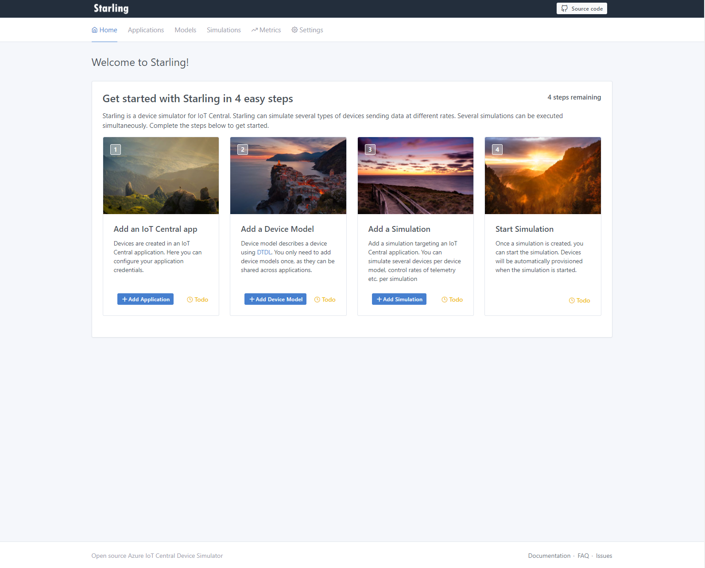
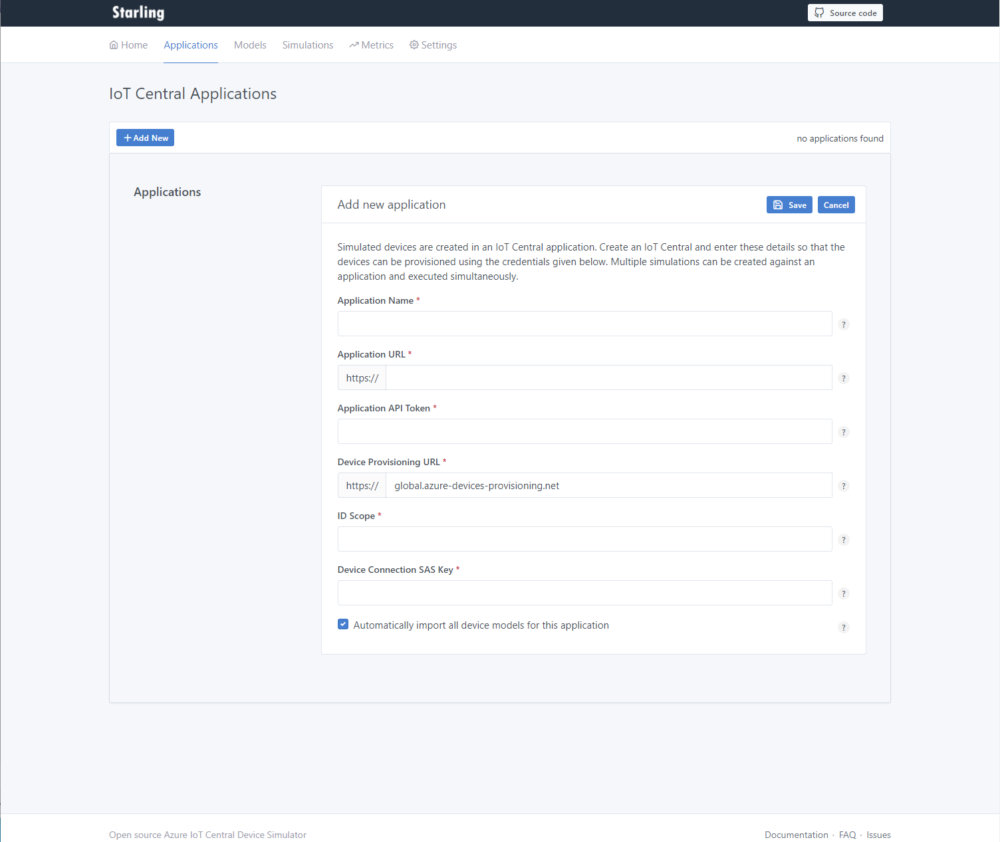
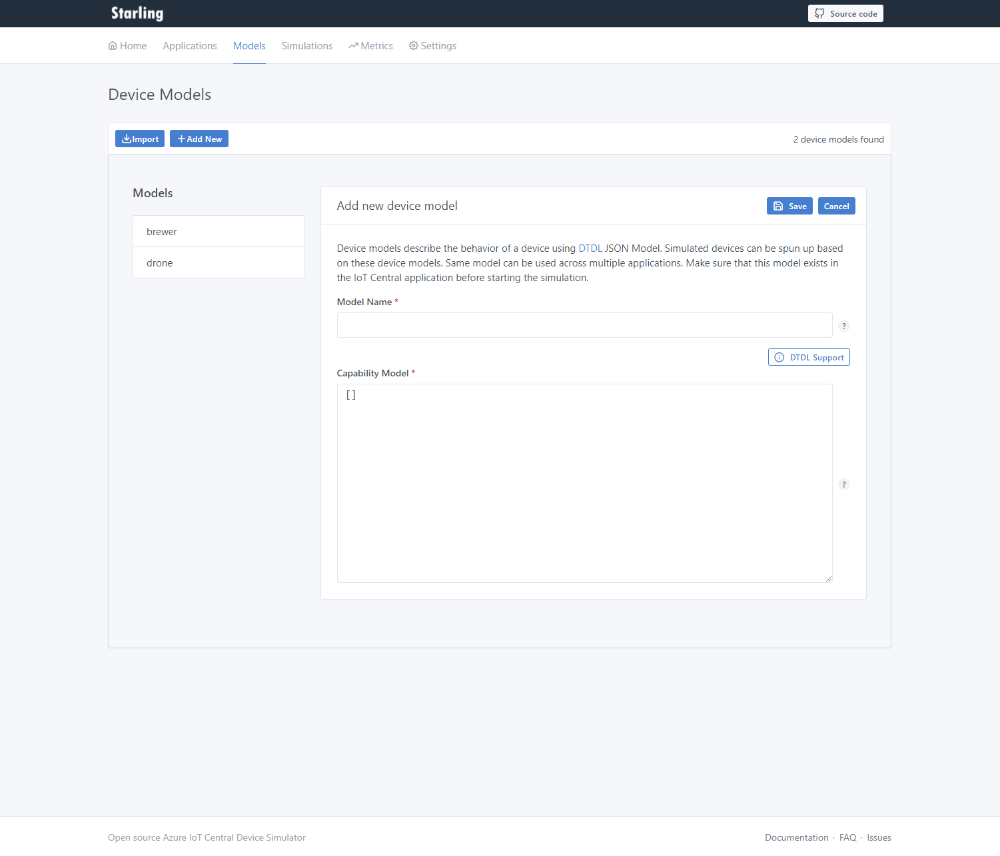
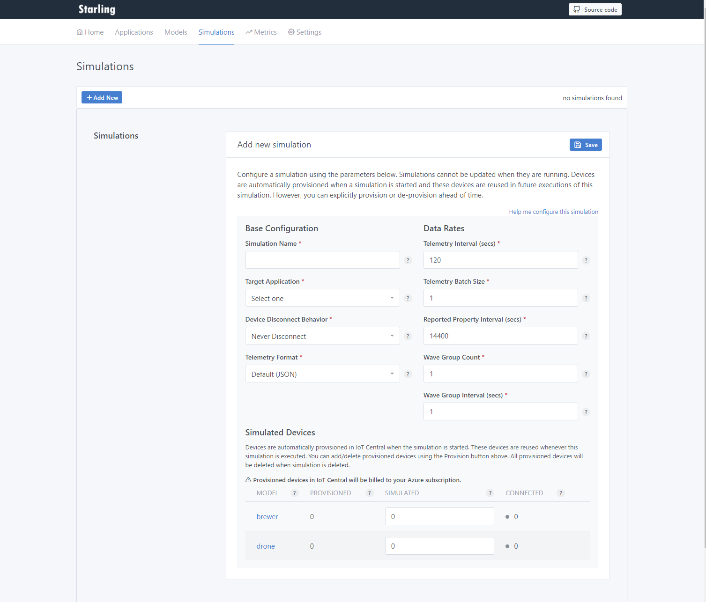
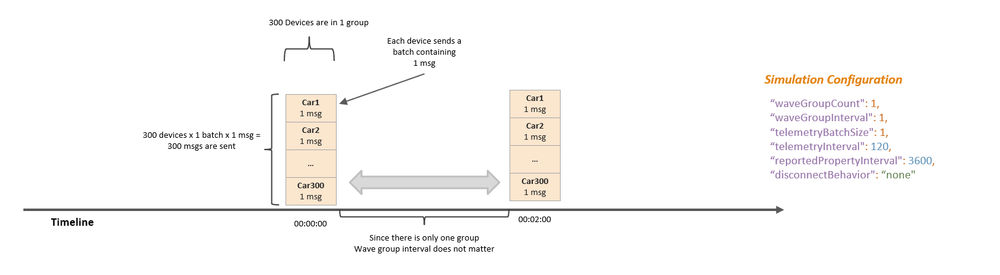
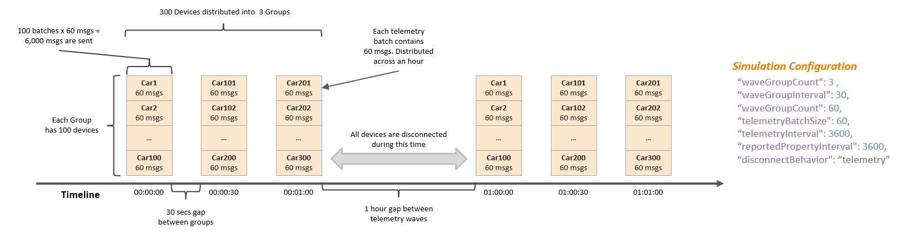

### Configuring and running simulations ###

Starling is a device simulator for IoT Central. Starling can simulate several types of devices sending data at
different rates. Several simulations can be executed simultaneously. 

You can follow along the startup wizard to complete these following steps:

1. **Add an IoT Central application:**  Add the application details such as the URL, Device Provisioning Service (DPS) ID Scope,
   Device connection SAS Key. Make sure you check the *Automatically import all device models for this application* to
   import all device models after adding the application to Starling.
   

2. **Add Device Models:** Device models are automatically imported from the previous step. Capability model is any 
   [DTDL](https://github.com/Azure/opendigitaltwins-dtdl/blob/master/DTDL/v2/dtdlv2.md) compatible device model.
   You can get the capability model for your device template from
   IoT Central application >  Device Templates > Select your model > *Export*.
   
3. **Add Simulation:** Add a new simulation. See the section below on how to configure a simulation.
   
4. **Start Simulation:** Once the simulation is added, you can simply start it. It will automatically provision devices
   in the application and start simulating them. If you change the number of devices in an existing simulation,
   additional devices are added. Devices are not deleted when simulated device count is reduced.
   You need to go to the Simulation > Provision screen and reduce the provision device count to delete them. Devices
   are deleted when the simulation is deleted.
   

### Configuring Simulation ###
Starling simulations can be configured to simulate wide array of scenarios. 

#### Concepts ####
Starling divides entire fleet of devices in a simulation into wave groups and generates telemetry messages in waves.
E.g.: You can divide your 1000 devices into 4 waves each containing 250 devices each and generate telemetry 5 minutes
apart from 250 devices at a time. 

#### Simple Simulation ####
Here is a simple configuration simulating 300 devices that are always connected and send telemetry every 2 minutes:

Parameter                  | Value            | Description
---------------------------|------------------|------------------------------------------------------------
Telemetry Interval         | 120              | Generate telemetry every 2 minutes
Telemetry Batch Size       | 1                | Send 1 message every time a device sends telemetry
Reported Property Interval | 14,400           | Send reported properties every 4 hours
Wave Group Count           | 1                | Treat the entire fleet as a single wave group i.e. all devices send telemetry at the same time
Wave Group Interval        | 1                | Since the Wave Group Count is 1, this value does not matter
Device Disconnect Behavior | Never Disconnect | Device is always connected and never disconnected from IoT Central
Telemetry Format           | Default (JSON)   | Device sends standard JSON adhering to DTDL format

#### Complex Simulation ####
Here is a complex configuration simulating 300 occasionally connected devices that send batched telemetry once an hour and disconnect:

Parameter                  | Value            | Description
---------------------------|------------------|------------------------------------------------------------
Telemetry Interval         | 3,600            | Generate telemetry every hour
Telemetry Batch Size       | 60               | Send a batch of 60 messages every time a device sends telemetry
Reported Property Interval | 14,400           | Send reported properties every 4 hours
Wave Group Count           | 3                | Divide the fleet into 3 wave groups each with 100 devices
Wave Group Interval        | 30               | Give a 30 seconds gap between sending telemetry waves 
Device Disconnect Behavior | Telemetry        | Device should disconnect from IoT Central after sending telemetry
Telemetry Format           | Default (JSON)   | Device sends standard JSON adhering to DTDL format

[Back to contents](../README.md)| Previous: [Running server](running.md) | Next: [Setting up metrics collection and dashboards](metrics.md)
---------------------------------|-------------------------------------------------------|------------------------------------
